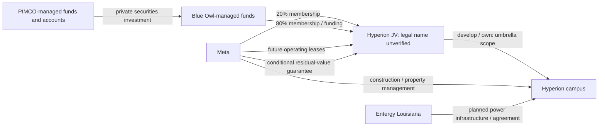

# Hyperion — separate asset, ownership, finance and obligations

Research as of 2026-10-07. Case identity: `hyperion`; overlap umbrella `hyperion-campus`. This is a research case, not a return or credit-risk conclusion.

## Source register

| ID | Document / date | Evidence |
|---|---|---|
| meta-jv | [Meta JV announcement](https://investor.atmeta.com/investor-news/press-release-details/2025/Meta-Announces-Joint-Venture-with-Funds-Managed-by-Blue-Owl-Capital-to-Develop-Hyperion-Data-Center/), 2025-10-21 | PRIMARY_TRANSACTION |
| cc-pimco | [Clifford Chance client announcement](https://www.cliffordchance.com/news/news/2025/10/clifford-chance-advises-pimco-funds-on-investment-to-develop-metas-hyperion-data-center.html), 2025-10-27 | PRIMARY_TRANSACTION; direct adviser, not complete bond terms |
| meta-2025k | [Meta 2025 10-K, Note 5](https://www.sec.gov/Archives/edgar/data/1326801/000162828026003942/meta-20251231.htm), filed 2026-01-29 | PRIMARY_ACCOUNTING; December 31 position |
| meta-2026q2 | [Meta Q2 2026 10-Q, Note 5](https://www.sec.gov/Archives/edgar/data/1326801/000162828026050705/meta-20260630.htm), filed 2026-07-30 | PRIMARY_ACCOUNTING; June 30 position |
| meta-engineering | [Meta infrastructure article](https://engineering.fb.com/2025/09/29/data-infrastructure/metas-infrastructure-evolution-and-the-advent-of-ai/), 2025-09-29 | PRIMARY_PROJECT; forward operational expectation |
| meta-expansion | [Meta Louisiana expansion](https://about.fb.com/news/2026/07/teachers-local-businesses-win-as-meta-expands-louisiana-data-center/), 2026-07-13 | PRIMARY_PROJECT; planned regional scope |
| entergy-substation | [Smalling groundbreaking](https://www.entergy.com/news/entergy-louisiana-breaks-ground-on-key-substation-to-power-data-center-in-richland-parish), 2025-06-27 | PRIMARY_PROJECT |
| entergy-approval | [Entergy LPSC approval announcement](https://www.entergy.com/news/entergy-louisiana-receives-lpsc-approval-for-major-infrastructure-investments-to-support-metas-data-center-and-improve-reliability), 2025-08-20 | PRIMARY_PROJECT, not the order itself |
| entergy-expansion | [Expanded power agreement](https://www.entergy.com/news/entergy-louisiana-announces-a-new-agreement-with-meta-that-will-deliver-an-additional-2b-in-customer-savings), 2026-03-27 | PRIMARY_PROJECT; utility plans |
| sp-webinar | [S&P rating webinar summary](https://www.spglobal.com/ratings/en/events/webinars/ifr-largescale-pf-102325), 2025-10-23 | SECONDARY_RESEARCH for borrower/capacity details |
| brookings-paper | [BPEA draft](https://www.brookings.edu/wp-content/uploads/2026/09/4c_Van-Nieuwerburgh.pdf), 2026-09-04 internal draft | SECONDARY_RESEARCH; Figure 2 legal chain unverified |

Primary-source verification was attempted for material ownership, debt, lease, guarantee, recognition, location and power claims. The full S&P rating article and LPSC document fetch were unavailable to the research reader. Search snippets did not establish contract terms. No offering memorandum or title instrument was obtained. Reviewed web text is recorded without claiming a downloaded raw SHA.

## Verified facts, source estimates and unknowns

**VERIFIED FACT — issuer-reported transaction:** Richland Parish, Louisiana campus under construction; JV interests Meta 20%, Blue Owl-managed funds 80%. Meta provides construction/property management and will lease facilities. Approximately $7bn fund contribution and $3bn Meta distribution are transaction flows. They do not establish separately additive equity investment. The venture develops/owns the campus at an umbrella level; the exact title-holder is not primary-verified.

**SOURCE ESTIMATE:** approximately $27bn JV development cost covers buildings and long-lived power/cooling/connectivity. Meta's later planned 5GW compute campus and >$50bn regional investment use a broader, unreconciled scope. These are planned capacity/cost, not realized company PP&E. First operation was expected beginning 2028; lease commencement is separately 2029. Current operational date is UNAVAILABLE.

**VERIFIED FACT — financing adviser:** approximately $27.3bn private securities offering, PIMCO-managed accounts/funds majority investors, proceeds supporting the JV. **SECONDARY-REPORTED:** S&P names Beignet Investor LLC and a 2.064GW financed campus. Brookings identifies Laidley LLC and Project Beignet Holdings LLC in the asset chain. Exact legal borrower/title chain, rate, maturity, collateral and recourse remain UNAVAILABLE in the reviewed primary set; do not equate the offering issuer with the JV borrower or Meta corporate debt.

## Transaction graph

Solid relationships below are primary-supported **at the disclosed umbrella scope**. Fund groups are placeholders for managed accounts, not legal corporate parents.

Secondary appendix, **not upgraded to legal fact**: paper-reported Laidley asset ownership and Beignet Investor → Project Beignet Holdings interest. The registry retains these as separate `SECONDARY_REPORTED` edges/entities. No unsupported 100% subsidiary ownership, debt-guarantee edge or direct PIMCO → Meta loan edge is asserted.

## Accounting bridge

All amounts USD billions unless stated. Observation period differs from filing date and retrieval date. The entity is Meta for the issuer accounting rows; this is not a JV balance sheet.

| Economic concept | Reported value | Entity / classification | Location / recognition | Source | Overlap warning |
|---|---|---|---|---|---|
| Equity carrying value, 2025-12-31 | 1.83 | Meta equity-method investment | Non-marketable investments | meta-2025k Note 5 | Stock, not development cost |
| Equity carrying value, 2026-06-30 | 2.92 | Same investment, later period | Same category | meta-2026q2 Note 5 | Replaces current-period view, does not erase original |
| Initial lease commitment | ~12.31 | Future property leases, initial 4 years, renewal up to 20 years | Commences 2029; not current project lease debt | meta-2026q2 Note 5 | Same facilities as financing |
| RVG threshold | ~28, declining | Conditional fair-value shortfall support | Payments not probable; no RVG liability recorded | meta-2026q2 Note 5 | Neither fixed payment nor expected loss |
| Maximum exposure, 2025-12-31 | 45.95 | Issuer-reported VIE disclosure | Disclosure; multiple included components | meta-2025k Note 5 | Includes equity/lease/funding/RVG; do not add components again |
| Maximum exposure, 2026-06-30 | 46.03 | Later issuer-reported disclosure | Same category | meta-2026q2 Note 5 | Not invested capital or total debt |

**ACCOUNTING INTERPRETATION:** separate the equity-method stock, future lease flow and contingent RVG. Meta reports the venture as an unconsolidated VIE because it is not the primary beneficiary. That accounting conclusion does not imply no economic obligation or validate a legal non-recourse conclusion. RVG first-16-year protection is disclosed in the transaction announcement; optional lease duration is not a guaranteed 20-year payment stream.

## Power evidence

Smalling Substation groundbreaking and Meta funding are reported by Entergy. The March 2026 expansion plan includes seven gas plants with >5,200MW generation capacity, transmission, batteries, nuclear uprates and up to 2,500MW additional solar. These are planned utility-system resources; neither figure is operational campus IT load. Exact PPA/service term, contract value, interconnection/energization date, electricity price and project allocation remain UNAVAILABLE. Ratepayer-savings projections are not incorporated as observed benefits.

## DO NOT ADD

- JV development estimate, wider regional expansion estimate and company CapEx: scopes overlap or are unresolved.
- Private securities issuance, fund contribution and JV interests: capital flows may finance the same assets; funding is not additional physical investment.
- Future lease commitments, RVG threshold and project debt: different claims/support on related facilities, not independent asset costs.
- Issuer maximum exposure and its included components: already overlapping by definition.
- Year-end and mid-year carrying values: successive stock observations.
- Utility generation MW, campus planned compute GW and financed-campus capacity: incompatible native definitions/scope.

## UNAVAILABLE and next verification

No project-attributable recognized AI revenue, utilization, invested IT capital, operating cash flow, operating costs or return is identified. No AI ROI is calculated. Current project lease liability, remaining sponsor funding schedule, complete payment schedule and exact guarantee enforcement terms require further documents. Legal title, borrower, security and recourse require primary contracts; entity branding is insufficient. Scope reconciliation between original JV facilities and expanded campus is unresolved. The next phase should hydrate those documents and establish field-level evidence, rather than estimate missing numbers.
