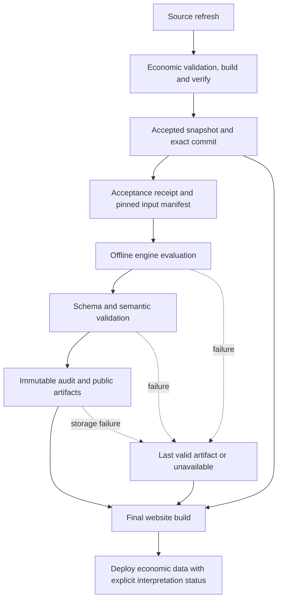

# Signal Engine production integration design

Status: design only; ready for a bounded pipeline implementation. No production integration is authorized by the existence of this document. Public version remains **1.0.0**. R1–R6 are closed; this design preserves their safeguards.

Companion documents: [public presentation](signal-engine-public-presentation.md) and [production acceptance](signal-engine-production-acceptance.md).

## 1. Pinned references and inspected production

| Reference | Identity |
| --- | --- |
| Production inspected, 2026-10-03 | `21cdb441befc2e3b3a52011093603911a67d9a5f` (`origin/main`) |
| Design branch, created from that main | `codex/signal-engine-production-design` |
| Validated engine | `139c36e5efd642aedcfd2a43194f5b8f09c7831e`, `codex/signal-engine-prototype-fixes-2` |
| Frozen methodology | `faaae287f1b144bd8396023a8f134b66ae84404c` |
| Rule version | `signal-engine-v0.1-draft.1` |
| Implementation | `offline-prototype/0.1.2` |
| Prototype input base | `b3d2fc295b0378c7d29ae6fe8d36e275a55753a9` |

The authoritative [configuration](https://github.com/ccesm/world-inflation-lens/blob/139c36e5efd642aedcfd2a43194f5b8f09c7831e/research/signal-engine/signal-engine-v0.1-draft.json), [output schema](https://github.com/ccesm/world-inflation-lens/blob/139c36e5efd642aedcfd2a43194f5b8f09c7831e/research/signal-engine/output.schema.json), and [engine implementation](https://github.com/ccesm/world-inflation-lens/tree/139c36e5efd642aedcfd2a43194f5b8f09c7831e/research/signal-engine/engine) were inspected through Git history. They are not copied into this design branch.

Between that engine reference and inspected main, the production `src`, `scripts`, `.github`, `data`, and `package.json` comparison shows only six data-file differences: five international snapshot/summary/revision files and the update ledger. These are input drift, not a reason to merge or rebase the prototype. New production values must be evaluated honestly; the frozen prototype's expected states are regression fixtures, not requirements for newer inputs.

## 2. Existing boundaries that the implementation must respect

- `scripts/refresh-data.mjs` downloads candidates, validates them, and calls `replaceBundle` with **build and verify inside its rollback transaction**. A failure there restores economic data. Signal generation must not be added to this callback or made a prerequisite of its build/verify checks.
- `.github/workflows/deploy.yml` runs refresh, commits accepted snapshot files, records the exact snapshot SHA, then builds/verifies and deploys Pages. Scheduled refresh, notification, deployment, and safe status publication already have distinct outcomes.
- `scripts/publish-system-status.mjs` publishes an allowlisted document to `system-status`, preserving prior successful deployment identity and rejecting older outcomes. It does not publish engine artifacts today.
- `src/utils/systemStatus.js` uses a strict allowlist. Adding an arbitrary field to existing JSON will not make it a supported health contract. Engine health needs its own versioned contract and later explicit UI plumbing.
- `src/App.jsx` already lazy-loads detailed research pages. `src/utils/routing.js` contains six primary routes. `src/data/researchArchitecture.js` separates research relationships from the series metadata contract.
- GitHub Pages uses `/world-inflation-lens/`. All future artifact URLs must respect this base. No browser macroeconomic API calls or browser engine execution are needed.

## 3. Integration architecture

Keep the evaluator an offline Node process. Introduce a thin, separately versioned production adapter around the validated engine. The adapter owns accepted-input capture, invocation, public projection, storage, and status. It cannot classify factors or modify thresholds. React consumes a validated public projection only.

The optional artifact edge cannot make a valid economic refresh depend on engine success. Ordinary production build/verification failures retain their existing blocking behavior. Signal-specific failures are caught at the adapter boundary, recorded, and converted into an explicit fallback manifest before the final build. Do not suppress unrelated failures with broad `continue-on-error` handling.

### Bringing the validated engine forward

The next implementation task should selectively import the necessary isolated engine, tests, frozen five specification files, and lock/contract fixtures from the validated commit. Do not merge the prototype branch or copy generated output directories. Pin the source commit and tree/file hashes; preserve the original implementation identity. Give the wrapper and public projection their own versions.

The frozen configuration says `productionEnabled: false` and `OFFLINE_DRAFT_NOT_EMPIRICALLY_VALIDATED`. Keep those bytes unchanged. Phase 1 is production-side **shadow generation**, with publication disabled in a separate adapter policy. This design does not turn a draft rule into an empirically validated rule. Any later public exposure needs its own approved release gate and explicit adapter publication policy, while continuing to disclose provisional rules. Never flip the frozen flag in place.

`specEnvironment` pins five authoritative files and eight production contract modules. Verify those hashes at integration and every invocation. A future contract mismatch must stop Signal Engine generation, with normal economic deployment still permitted. It must not be bypassed by rewriting the lock. Resolve a genuine incompatibility in a separately reviewed adapter/engine update.

Production currently selects Node 22; the reference output includes the runtime and timezone database in its deterministic payload. Pin an exact runtime for the isolated engine job and qualify it with the engine suite and fresh-process reproduction. Keep the existing website runtime unless separately needed. A runtime change creates a different qualified artifact identity; do not require the old prototype hash on a different runtime or input snapshot.

The CLI's `captureManifest` records local generic/international validation, not proof of the full production acceptance chain. A production receipt must additionally bind the completed economic gates and exact committed bytes. Capture genuinely current first-seen, validation, recording and acceptance timestamps; never backdate them to source retrieval or Git commit time. Where reliable earlier receipts do not exist, acceptance begins now and earlier project replay is unavailable.

The existing offline output path guard stays intact. Evaluate into its permitted isolated temporary directory, validate there, then let the adapter publish approved bytes. Do not broaden the engine's filesystem permissions to write production data.

## 4. Contracts: separate interpretation, run, and deployment

Define new wrapper contracts during implementation; do not change `signal-output/0.1`. This document specifies their fields and invariants. A machine-readable schema is intentionally deferred until the adapter is implemented; schema and independent semantic validation are release gates.

### 4.1 Immutable public interpretation payload: `signal-public/1`

| Field | Required meaning |
| --- | --- |
| `schemaVersion`, `projectionVersion` | Public contract and allowlist/translation projection identity |
| `engineVersion`, `ruleVersion`, `ruleSha256` | Exact validated implementation and frozen rule; no application-version substitution |
| `engineReferenceCommit`, `adapterCodeCommit`, `engineCodeHash` | Public repository provenance of executable code, separate from input SHA |
| `engineSchemaSha256`, `publicSchemaSha256`, `enginePayloadSha256` | Exact internal schema, public schema and original deterministic engine payload identity |
| `generatedFromSnapshot` | `{commit, inputManifestSha256, acceptanceReceiptSha256, acceptedAt, datasets[]}`; logical dataset IDs and exact canonical/raw hashes, with null plus reason when raw bytes were not retained |
| `mode`, `asOf`, `periodCutoff`, `evaluatedAt`, `historicalAvailabilityClaim` | Preserve engine semantics exactly; initial public artifacts accept only `CURRENT_SNAPSHOT`, non-null UTC as-of, null period cutoff, false historical claim |
| `factors[]` | Exactly the seven unique frozen IDs; objects described below |
| `groups` | Ordered factor IDs for `DOMESTIC_PURCHASING_POWER` and `INTERNATIONAL_DOLLAR_ROLE`; organization only |
| `limitations` | Reviewed, versioned scope/limitation codes and necessary safe parameters |
| `detailsRef` | Same-origin content-addressed research-details artifact and digest, bound to the same engine payload/input identity |
| `methodologyRef` | Immutable rule/config reference and approved methodology link |
| `sensitivityRef` | Matching endpoint/grid/input/rule report digest, or explicit unavailable state; never a stale report from another evaluation |

Each factor preserves `factorId`, `ruleVersion`, engine `direction` (exposed as `state` without reinterpretation), `confidence` (labelled evidence quality), `dataStatus`, derived `availabilityBasis`, `observationThrough`, alignment, quality reasons, limitations, source statuses, change reasons and last-valid reference. Add only presentation data: approved title key, primary series ID, exact primary metric and transformed window reference, evidence/counterevidence/context references, sensitivity status, and approved research/methodology links. No numeric confidence, weighted values, score or overall directional classification.

State and confidence are copied from the semantically validated engine output. Group `evidencePattern` and any headline outcome verdict are not exported. Do not infer support/opposition from signs or count positive factors. Context and decomposition retain their explicit non-voting role.

Hash canonical UTF-8 payload bytes using a specified stable key ordering and newline convention, matching the engine's canonical serializer where applicable. **Do not put the payload's own hash inside those hashed bytes.** The immutable filename and manifest supply `publicPayloadSha256`; the payload references the original engine digest separately. Raw input identity, canonical identity, engine identity and public projection identity are distinct hashes.

### 4.2 Research-details payload: `signal-details/1`

Deferred public data must let a researcher reproduce the state: all required raw window observations, native period start/end/label, units, denominator, publisher/source URL, transformation ID/formula, unrounded transformed values, entry/quiet thresholds, confirmation count, comparison precision, and applied rule. Preserve operands, dependency roles, eligible revision references, observation availability basis, source update/retrieval/acceptance information, freshness at evaluation and limitations. Missing values stay null with a reason. Display rounding never changes comparison.

All IDs are opaque stable public IDs with a deterministic mapping to internal lineage. Referential integrity must be checked end to end. Do not rename `NOT_RECONSTRUCTED` availability to a publisher proof. A source-updated date is not necessarily an original release timestamp. Null or date-only publisher evidence must remain uncertain, with precision shown.

### 4.3 Separate run record: `signal-run/1`

Record an immutable safe run ID, attempt, start/end, pinned input and code identities, evaluation request, outcome, reused/new artifact digest, previous-valid digest, validation outcomes and a bounded public failure code. Retain raw diagnostic text internally only. Suggested outcomes are `SUCCESS_NEW`, `SUCCESS_REUSED`, `FAILED`, `SKIPPED_NO_ACCEPTED_INPUT`, and `DISABLED`; these are operational enums, not new factor states.

Distinguish actual `lastSuccessfulEvaluationAt` from `lastSuccessfulReuseCheckAt`; a reuse check is not an evaluation. Generation/upload/deployment times never become an observation date or confirmation period.

### 4.4 Build-pinned manifest: `signal-deployment/1`

Always emit a small manifest, including when no interpretation exists. It contains application/code identity, the **economic snapshot built into this website**, its acceptance reference, selected public/details digests, selected interpretation's input SHA/as-of/evaluated-at, last attempt/result, last successful evaluation, and display relation:

- `MATCHES_DEPLOYED_INPUT`: selected artifact matches the built economic input manifest and qualified code policy.
- `LAST_VALID_INTERPRETATION`: selected artifact is retained after failure, incompatibility, or newer accepted input.
- `UNAVAILABLE`: no verified compatible artifact can be supplied.

Separately expose `ageStatus: WITHIN_EVALUATED_WINDOW | RECHECK_DUE | UNKNOWN`, derived from the stored as-of and applicable freshness boundaries. Matching input is not proof of current freshness. Never replace an old artifact's as-of with deployment time.

Post-deployment status records `deployedAt` only after successful deployment; it references the build manifest digest rather than changing the immutable payload. The browser uses its build-pinned artifact. An independently fetched newer health record may announce a newer deployment/failure, but cannot switch the current page to an artifact for different economic data. Unknown network status is not success or failure inferred from age alone.

## 5. Generation and failure isolation

1. Finish the existing economic refresh transaction and all its required checks. A rejected candidate never enters the engine.
2. Commit accepted economic bytes and record the exact SHA. On a code-only build or refresh-disabled run, validate the pinned existing bundle and bind a new genuine receipt, or use its verified retained receipt. Do not infer acceptance from branch membership.
3. Build a manifest covering all engine-required datasets, metadata, context, imputation and operational evidence. Validate receipt chronology, hashes, contracts and complete archive identity. Pin code and input separately.
4. Run only `CURRENT_SNAPSHOT` in Phase 1. Explicitly supply as-of and evaluated-at, chosen after acceptance; no implicit clock or silent mode fallback. Capture cutoff-eligible operational evidence once so evaluation and validation see the same archive.
5. Run frozen schema and semantic validation against that archive. Independently validate the public projection, details, disclosure mappings and matching sensitivity report. A missing publisher proof must never be synthesized.
6. Persist immutable internal evidence and public artifacts, verify read-back hashes, then atomically publish a success manifest. An incomplete write is not a successful evaluation available for use.
7. Build using the chosen artifact or fallback manifest. Deployment proceeds under existing economic/build gates. Record deployment outcome independently.

| Economic outcome | Signal outcome | Website behavior |
| --- | --- | --- |
| Refresh rejected | Not run on candidate | Existing economic failure behavior; never interpret failed candidate |
| Valid accepted data | Evaluation/projection/storage succeeds | Supply new validated artifact for the same input |
| Valid accepted data | Engine throws, times out, schema/provenance fails | Deploy valid data with last verified compatible interpretation; label update failure and input mismatch |
| Valid accepted data | No prior artifact, incompatible public schema, corrupt fallback | Deploy data with interpretation unavailable |
| Valid accepted data | Signal store/network unavailable | Use verified locally retrieved prior artifact if present; otherwise unavailable; do not block data deployment |
| Valid accepted data | All factors unassessable but valid engine output | Successful engine run; individual factors remain insufficient, never carry forward old direction |
| Valid artifacts | Website deployment fails | Keep last deployed website/manifest; retain new artifacts as generated, not deployed |

Conceptually `DATA_REFRESH_SUCCESS` can coexist with `SIGNAL_ENGINE_FAILED`. Preserve actual existing data outcome enums rather than replacing them with these conceptual labels. Do not alter production notification triggers, Gmail results or message semantics. Signal health is reported through its own status/log record; no new email interpretation or alert is included.

Fallback selection must verify artifact integrity, supported public schema, approved engine/rule identity and complete referenced files. A corrupted newest artifact can fall back to a verified earlier approved artifact. If none is safe, return unavailable. Do not recompute old payloads with a newer validator and call them the original.

Whole-page fallback is distinct from `lastValidArtifactRef` on an individual factor. The former shows a visibly dated prior interpretation because the new run failed. The latter is a history link inside a successfully validated output whose current factor can be `INSUFFICIENT_DATA`/`UNASSESSED`. Neither may substitute an old direction into current factor fields.

## 6. Release timing, reuse and identity

Choose **B: a new run record may point to identical deterministic content**. The safe first implementation evaluates on each scheduled invocation; it may reuse an artifact on an exact retry of the same evaluation request. Do not introduce an aggressive values-only cache.

Reuse requires identical accepted input/receipt identity, raw and canonical hashes, eligible metadata, rule/config/schema/code/runtime, evaluation as-of, evaluated-at, prior-artifact reference and sensitivity parameters. A retry may retain the original explicit evaluation timestamps and record the new wall-clock invocation only in the run record. If any interpretation input differs, evaluate and retain a new deterministic payload even when factor states are unchanged.

The current engine includes explicit `evaluatedAt` and runtime in deterministic content. Daily invocations with a new as-of normally create a new engine artifact. They are labelled **re-evaluated; no new observations** where independently verified, not “new evidence.” A later optimization could reuse across dates only after a reviewed equivalence proof covering freshness/release boundaries; that optimization is outside Phase 1.

Do not use `SUCCESS_NO_CHANGE` or unchanged numerical observations as an identity key. Raw bytes, revisions, acceptance, quality, context or source vintage may change independently. R5 requires an auditable non-directional identity/status change for analytically equivalent inputs. Future-ineligible metadata must not affect an earlier replay's content or hash.

Keep these clocks distinct: observation period; source release/update with precision; retrieval; first-seen/validation/acceptance; requested engine as-of; engine evaluation; run completion; website deployment. Monthly and quarterly factors retain native frequency. Factor cards show their own observation endpoints; there is no shared “latest month” obtained by interpolation.

## 7. Immutable retention and publication

Use content-addressed names, for example `public/signal-public-1/<public-sha256>.json` and `details/signal-details-1/<details-sha256>.json`. Engine/rule/input identities live in their payloads and indexed manifests. Existing bytes at a digest path must match exactly or publication fails. Different rules, engine code, inputs or projections coexist; never overwrite a historical artifact.

Recommended persistence has two explicit boundaries:

**Phase 1 writes only to restricted storage**, including draft public projections and safe manifests. Exercise the public-store adapter against isolated fixtures without creating a publicly readable conclusions archive. The public branch described below begins only with separately approved Phase 2 publication. This keeps shadow generation genuinely unpublished.

1. In Phase 2, a dedicated **public data-only `signal-artifacts` branch**, separate from `main` and `system-status`, retains only allowlisted public payloads, details, safe run records and manifests. Publish blobs and their referencing manifest in one Git tree/commit; advance the ref with compare-and-swap/non-force semantics. On a race, re-read and reject superseded attempts rather than overwriting a newer success. Bind ordering to accepted workflow sequence/run attempt and input lineage, not a lexical SHA or an untrusted timestamp. This branch is proposed, not created by this design.
2. A **restricted durable audit archive** retains original engine payloads, accepted manifests/receipts, predecessor chains, exact code/runtime qualification and internal validation reports. Recommendation: a private companion Git repository, provisioned separately with a narrowly scoped repository credential. Its endpoint and credential are runner-only; no public artifact contains them. Treat provisioning as a Phase 1 promotion prerequisite. Local fixture storage supports implementation and tests before provisioning; temporary Actions artifacts alone are not durable retention.

Do not put internal-only records into a public branch because their directory is called “internal.” Public safe source snapshots remain reproducible from retained repository commits; raw publisher bytes that were never archived remain explicitly unavailable. No promise of publisher-vintage reconstruction follows from this store.

Retain every published artifact and all transitive predecessor/input/receipt references; no automatic garbage collection in the first integration. Track size growth before adding historical outputs. Git history alone is insufficient if referenced private objects or raw files are missing. Maintain a restore procedure and verify a restored chain before promotion. A restricted archive outage is a Signal Engine storage failure, not an economic refresh failure.

For Phase 2, copy the selected public artifact/details and build manifest into the Pages package under the configured base path. Keep archived versions in the artifact branch so a website replacement does not erase research history. Use hash-addressed URLs for immutable caching and revalidation for mutable health pointers. Verify hashes and schema before rendering; reject traversal, arbitrary hosts and missing referenced blobs.

Only advance the “last successfully deployed interpretation” pointer after Pages succeeds. Generated, accepted for publication, and deployed are separate milestones. A newer failed run may update last-attempt health without deleting the previous successful artifact. Rollback selects a prior approved manifest/artifact; it does not rewrite artifact bytes or roll back accepted economics merely to match them.

The prototype recursively validates predecessors using a context. Across implementation/rule/runtime changes, retain the matching validated context or use version-dispatched validation against retained inputs. Do not blindly pass an old artifact to a new engine's `--previous`. In Phase 1, continuation is limited to a compatible qualified version; otherwise start a documented new evaluation chain and preserve old history separately. Cross-rule state comparison is future work.

## 8. Public versus internal information

| Offline field/content | Classification | Production handling |
| --- | --- | --- |
| Factor IDs, exact states, quality, observation periods, transforms, units, denominator, publisher | PUBLIC SAFE | Summary/details as appropriate; bilingual copy comes from a reviewed dictionary |
| Source URLs, source-series keys, revisions and citations | NEEDS TRANSFORMATION | Validate public publisher URLs and approved identifiers; reject credentials, tokens, private hosts and unsafe schemes |
| Rule/engine versions, public commits, config/schema/input/raw hashes | PUBLIC SAFE | Details show exact provenance and raw-retention limitations |
| Full required observation windows, operands, thresholds, alignment, freshness/availability proof summaries | PUBLIC SAFE | Deferred research details, preserving precision and uncertainty |
| `snapshotPath`, `datasetId`, `inputVintageId`, lineage IDs embedding paths | NEEDS TRANSFORMATION | Map to logical dataset IDs and opaque digest IDs; optionally approved public Git blob links in research details |
| `evidenceRef`, `methodologyRef`, quality/limitation text and arbitrary exception strings | NEEDS TRANSFORMATION | Resolve through allowlists/code-to-copy mappings, not blind string copying |
| CLI `artifactPath`, run metadata paths, local filesystem roots, PIDs, host/user identity | INTERNAL ONLY | Never serialized into public JSON, client logs, URLs or source maps |
| Full acceptance/validation diagnostics and raw engine payload | INTERNAL ONLY | Restricted audit archive; publish safe proof summary/digests only |
| Runtime and timezone database | INTERNAL ONLY by default | Preserve exact values for reproduction; public details may link a reviewed runtime qualification record |
| Credentials, mail addresses, secrets, private repository endpoint, provider error bodies | INTERNAL ONLY | Exclude even from ordinary diagnostics where possible; never copy into archives/public output |

Projection uses an explicit allowlist with `additionalProperties: false`, not a blacklist. Public refs resolve only to approved static artifacts and repository/publisher URLs. Render strings as text, not HTML. Bound arrays, string lengths and artifact sizes; validate timestamps with strict calendar/offset semantics. Verify semantic equivalence to the pinned internal output **after** projection, including factor availability basis. A valid JSON shape or a matching self-supplied hash is not provenance proof.

## 9. Data Health, rollout and next implementation

Expose an independent **Interpretation engine** health section in Phase 2 Sources/Data Health. Fields: engine state, rule/implementation, input and deployed snapshot identities, last actual successful evaluation, last reuse check, current artifact digest, last attempt/failure code/time, interpretation age/as-of, observation endpoints and coverage (assessed/unavailable factors). Coverage is completeness, never a count of favorable factors. Underlying source freshness remains independently visible. A healthy engine can evaluate stale/incomplete sources; successful deployment does not imply healthy evidence.

Phase 1 may produce this safe health contract without displaying it or modifying current `system-status` schema. Add browser plumbing only in the UI phase. On health fetch failure, show status unavailable and retain the build-pinned interpretation with its original timestamps; never silently mark it current.

| Phase | Scope and exit |
| --- | --- |
| 1 — pipeline shadow | Accepted-input adapter, frozen evaluator, semantic/public validation, immutable stores, safe status, deterministic run records and tested failure isolation. No public page, navigation, Home import or production endpoint serving conclusions. Store reviewed projections for later promotion. |
| 2 — current research page | Separate approved UI change: lazy route, seven current cards, matching sensitivity disclosure, details, Data Health, fallback and bilingual/accessibility gates. No history or Home conclusion. |
| 3 — optional history | Native-period current-vintage reconstruction, explicit coverage/warm-up/revision limits. Publisher replay remains unsupported. Separate performance/retention review. |
| 4 — optional broader discovery | Consider contextual Dollar/Home integration only after usage and comprehension evidence; no implied approval, no aggregate. |

**Next engineering task:** implement Phase 1 only on a new branch from then-current production. Selectively import the validated engine and immutable contracts; implement production acceptance receipts, isolated evaluation, validators/projection, storage adapters, safe run/health manifests, explicit fallback and fault-injection tests. Qualify runtime and retention. Workflow changes needed for that future task must be scoped to the post-economic-acceptance optional path. Do not implement React, public route, methodology changes, historical sweeps or emails in that task. Complete [Phase 1 acceptance gates](signal-engine-production-acceptance.md) before requesting any promotion.

Decision: **READY FOR PRODUCTION PIPELINE IMPLEMENTATION**. This is a design readiness decision, not approval to merge, deploy, publish interpretations or change version 1.0.0.
