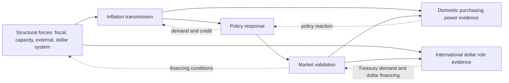

# Signal Engine specification — offline v0.1 draft

Status: **READY FOR OFFLINE PROTOTYPE**, subject to the implementation acceptance gates in [the validation plan](signal-engine-validation-plan.md). This is approval of a testable research design, not validation of thresholds, economic predictions, or a production release.

Inspected base: `origin/main` at `b3d2fc295b0378c7d29ae6fe8d36e275a55753a9`, production version `1.0.0`; design branch `codex/signal-engine-spec`. Inspection date: 2026-10-03. Economic snapshots, production code, public version, workflows, notification behavior and deployment remain unchanged. No engine or UI is implemented here.

Companions: [factor decisions and inventory](signal-engine-factor-matrix.md), [validation plan](signal-engine-validation-plan.md), [draft rule configuration](../research/signal-engine/signal-engine-v0.1-draft.json), [output schema](../research/signal-engine/output.schema.json). Configuration is normative for identifiers, numerical parameters and output labels; this document is normative for semantics and algorithms. Any disagreement blocks implementation until corrected under a new draft revision.

## 1. Research purpose and boundaries

Keep **Domestic Purchasing Power** and **International Dollar Role** separate. Describe observable conditions and their limitations. Do not produce a Dollar Score, weighted total, regime probability, forecast, trading instruction, or causal estimate.

The existing research sequence remains an organizing model:



Arrows show possible channels, not identified causal effects, an additive equation, or guaranteed time ordering. Outcomes feed back through policy and financing conditions. The computational dependency graph below must remain acyclic even though economic feedback is real: a factor never consumes another factor's current output as fresh independent evidence.

Principles: named evidence and explicit rules; deterministic reproduction; release and revision awareness; no lookahead in modes making historical availability claims; native frequencies; explicit missingness; one primary owner per measurement; narrowly defined direction; no hidden model or investment advice. Source prestige does not prove a causal interpretation.

## 2. What the repository currently supports

Inspected `seriesRegistry.js`, `seriesContract.js`, `researchArchitecture.js`, `monitor.js`, `drivers.js`, `productivity.js`, `externalShocks.js`, `internationalDefinitions.js`, `internationalDollar.js`, `digitalMoney.js`, `catalog.js`, freshness/time semantics/release calendar/Treasury pricing/productivity utilities, the snapshots and their revision/import records, and V0.13/V1.0/international methodology documentation.

The V0.13 contract already distinguishes observation period, source update, retrieval, review, maintenance type and research role. It supports `AUTOMATIC`, `MANUAL_REVIEWED`, `FIXED_VINTAGE`, `DERIVED`, `STATIC`, `PLANNED`. Preserve these meanings. An engine evidence wrapper is additive; it must not rewrite registry roles, units or timestamps to fit this design.

Existing strengths include explicit quarterly anchors, fiscal-year series, exact-date Treasury arithmetic, complete-quarter GDP/employment derivation, source-specific freshness rules, validated refreshes and bounded revision ledgers. Existing limitations include snapshot-level rather than per-observation availability, incomplete retained historical vintages, occasionally unknown or coarse source-update dates, and publication facts with no observation date. A latest update field is not the original release date of every row.

The international snapshots provide revised COFER currency composition, TIC holdings, and BIS credit stocks. They do not provide a complete international-dollar system: trade invoicing, commodity invoicing, conventional payments, reserve alternatives and funding/carry conditions are unmeasured or partial. See the inventory for actual coverage, which differs substantially by source.

## 3. Three output levels

**Indicator:** return the raw value, native period, transformed value/unit, semantic state and full lineage. States are measurement-specific: e.g. `CORE_INFLATION_ACCELERATING`, `OUTPUT_PER_HOUR_GROWING`, `USD_RESERVE_SHARE_FALLING`. There is no universal good/bad sign. Numeric zero is a value, never a substitute for null.

**Factor:** return `factorId`, `direction`, `evidence` IDs, `counterevidence` IDs, `context` IDs, `confidence`, `qualityReasons`, `dataStatus`, per-input freshness, `observationThrough`, `availabilityBasis`, `alignment`, `changeReason`, `ruleVersion` and limitations. Evidence arrays reference records in a top-level lineage map. Context cannot raise the number of primary votes. Counterevidence means a specifically identified different channel or conflicting measurement, not an arithmetic deduction from confidence.

**Outcome:** two separate collections of factor IDs, contextual observations, coverage gaps and named contrasts. Neither has a numeric score or directional total. `coverage` is `PARTIAL` when any eligible factor exists and `INSUFFICIENT_DATA` when none does; it never says the whole research question is complete. `evidencePattern` may be `DESCRIPTIVE`, `MIXED`, or `INSUFFICIENT_DATA` using the narrowly enumerated contrasts in section 10.

`TRANSITION` means a complete, usable window fails the persistence rule. It does not mean missing data, an economic turning-point forecast, or a carried-forward prior direction. `LITTLE_CHANGE` means the declared transform remained in its quiet band; it does not mean low inflation, low risk, or a stable price level. `INSUFFICIENT_DATA` has null transform/direction evidence where unavailable and precise reasons. Last valid output can be linked separately, never presented as the current calculation.

## 4. Input evidence and timestamps

Every normalized observation has the following conceptual shape. See the JSON schema for machine constraints; the next implementation must also enforce cross-field invariants that JSON Schema cannot express.

| Field | Meaning |
| --- | --- |
| `seriesId`, `sourceSeriesKey`, `datasetId` | Registry identity, publisher identity and canonical dataset |
| `observationPeriod` | Kind, label, start and end; a quarter-start storage anchor becomes the whole quarter |
| `value`, `units`, `frequency`, `denominator` | Unmodified source semantics; explicit null when absent |
| `releasePublishedAt` | Publisher release evidence, if actually known; value, precision, timezone, evidence reference |
| `sourceUpdatedAt` | Source/distributor revision or file update; retain meaning and precision independently |
| `retrievedAt` | Repository retrieval metadata, preserving original precision; not assumed capture completion |
| `firstSeenAt` | Earliest retained evidence that this exact value-vintage was observed by this project |
| `snapshotAcceptedAt` | Proven completed validation of the retained snapshot |
| `availableAt` / `availabilityBasis` | Conservative instant admitted by the selected evaluation mode, or null |
| `validUntil` | Freshness eligibility boundary under a pinned policy; not an expiration of historical truth |
| `inputVintageId`, `snapshotSha256`, `rawSha256` | Immutable parsed snapshot and optional retained source payload identifiers |
| `freshnessState`, `maintenanceType`, `revisionEventIds` | Original contract status plus evidence lineage |

Separate **observation**, **publication**, **retrieval**, **validation** and **evaluation**. Current international `retrievedAt` is set from refresh start; it cannot prove data were captured/validated at that instant. Use a retained completion record tied to that snapshot hash, or establish a new offline validation acceptance now. Do not backdate acceptance.

Timestamp normalization returns bounds, not guessed precision. A documented date in a documented timezone yields the conservative upper bound at the next local midnight; a month yields the next month's local midnight. Admission is at or after that upper bound. Unknown timezone remains unknown unless an independent exact first-seen/accepted instant supplies a conservative bound. Never invent midnight UTC. Timezone and daylight-saving conversion use a pinned runtime/timezone database recorded in the manifest. Date-only ALFRED vintages cannot support claims about intraday availability without additional release evidence.

The as-of rule for an observed value is `availableAt <= asOf` and `observationPeriod.end <= asOf`, with a source-specific exception only for explicitly modeled publication/projection context. Fixed-vintage projections are available after their publication/acceptance even when their target years are in the future, but remain `CONDITIONAL_PROJECTION`; they never pass as observed factor inputs.

## 5. Evaluation modes and no-lookahead

| Mode | Required cutoff and input selection | Permitted claim |
| --- | --- | --- |
| `CURRENT_SNAPSHOT` | Explicit `asOf`; pinned snapshots validated by that instant; latest eligible observations in each | Descriptive assessment of the selected current snapshots |
| `CURRENT_VINTAGE_RECONSTRUCTION` | `asOf: null`; explicit `evaluatedAt` and historical `periodCutoff`; use a pinned modern vintage, filtering by observation end | Retrospective patterns under today's revisions; **not** a real-time backtest |
| `RECORDED_AS_OF` | Explicit historical `asOf`; latest immutable accepted project snapshot per dataset at/before it; exact retained values only | What this project could establish from its retained archive |
| `TRUE_RELEASE_VINTAGE` | Historical `asOf`; publisher-vintage values and verified release bounds for every required input | What was publicly available then; **deferred**, current repository insufficient |

No mode silently falls back to another. Missing archive proof in `RECORDED_AS_OF` returns `INSUFFICIENT_DATA`, even if a current snapshot contains the requested old period. The future prototype must reject `TRUE_RELEASE_VINTAGE` as unsupported until a separately reviewed archive adapter passes its gate. Current-snapshot revalidation can establish availability now, never at a historical cutoff.

For recorded replay, choose the latest complete accepted dataset snapshot at/before the cutoff, not a synthetic mixture of individual rows from different vintages. A withdrawal in that snapshot stays a withdrawal; do not recover a removed row from an earlier snapshot to fill a lag. All transform operands come from the selected vintage for that dataset. Across datasets, snapshots may differ in acceptance time; retain all times explicitly.

Rules prohibiting lookahead:

1. A 2026Q2 COFER observation cannot influence an as-of state before verified publication/project acceptance, even though its storage date is `2026-04`.
2. Monthly CPI for August is unavailable at August month-end when released in September. Month labels are not release dates.
3. A later revision never replaces a value in a previously published historical-as-of output. Recompute a separately identified retrospective artifact if useful.
4. Rolling windows end at the selected available observation; no centered windows, future normalization samples, or full-history percentile fitting.
5. A scheduled release calendar is an expectation, not evidence of a release or its values.
6. Today's validated/source-check status cannot be copied onto an old as-of date. Historical freshness is recalculated from the archived evidence and the policy version.
7. Retrospective reconstruction carries `historicalAvailabilityClaim: false` in every artifact. Its age check describes observation lag against `periodCutoff`, not historical operational freshness.

FRED defaults to today's information; its real-time API can select date-bounded historical information, which would require a future series-by-series vintage audit. [FRED real-time periods](https://fred.stlouisfed.org/docs/api/fred/realtime_period.html). No current source has a complete, verified publisher-vintage archive in this repository. Git snapshots can support limited project replay after their retained acceptance evidence; Git commit timestamps alone are not original publication proof.

## 6. Frequency alignment and freshness

Do not interpolate, forward-fill raw observations, or turn quarterly releases into monthly measurements. An unchanged quarterly factor may remain displayed between releases with its actual quarter and age. That is retention of an assessment, not manufacture of a new observation or confirmation.

Single-primary factors evaluate at their latest **available, non-null, eligible** period, but a missing latest reported value cannot be silently skipped: emit `MISSING_LATEST_VALUE`. Every period in the declared transform/persistence window must exist, be unique, finite and correctly ordered. Lags are exact calendar lags, never row offsets through gaps. Freshness applies to the selected source snapshot's latest observation and the factor's endpoint, not separately to historical lag operands. Old points in a complete window remain usable; their exact value-vintage availability must still pass the mode gate. Optional context is independently gated; missing context does not change primary direction, but produces partial coverage and caps confidence as specified below.

Context can be juxtaposed at different frequencies, always with its own observation period. A claimed contemporaneous comparison needs both latest period ends within 100 calendar days and overlapping measurement horizons. A factor's horizon is the closed interval from the first raw period start to the latest raw period end in its complete transform-plus-persistence window. A literal context horizon is its own observation period; a derived context horizon spans its required operands. Unknown starts/ends fail contemporaneity. Otherwise label `NOT_CONTEMPORANEOUS`, omit the contrast and cap alignment quality. This is an explicit prototype convention, not an assertion that effects occur within 100 days. There is no annual/quarterly fill into monthly rows. Fiscal-year facts retain fiscal-year labels.

| Frequency/type | Alignment/eligibility policy |
| --- | --- |
| Daily market data | Exact-date derivations only; normal weekends/holidays are not new observations. H.15/H.10 release model is retained for applicable series; T5YIFR uses its own contract, not an invented H.15 link. |
| Weekly WALCL | Wednesday observation anchor, H.4.1 calendar; one weekly position, not five daily observations. |
| Monthly | Exact month labels/end dates; source-specific age policy; no pending month required in a window ending at the latest available month. |
| Quarterly | Quarter-start storage dates interpreted as full quarters; complete calendar-quarter lags; never monthly interpolation. |
| Annual fiscal/other | Preserve fiscal versus calendar basis and source units. No current monthly direction from an annual observation. |
| Fixed vintage CBO | Vintage/release/target year and observed-versus-projected flag; no daily staleness or live observed vote. |
| Manual reviewed SIPRI/digital facts | Review age, publication and observation unknowns separately; review completion is not a new economic observation. |
| Derived | Require each source snapshot's eligibility, exact operand availability/alignment and a fresh derived endpoint; historical window operands do not expire individually. No missing-input arithmetic. |

Inherit V0.13 freshness without modifying it. Pin both contract/policy code hashes and evaluation time. Current maximum observation lags in days: core PCE 65; CPI/shelter/food/energy 50; wages/employment 45; M2 65; electricity-demand proxy 125; other monthly 75; quarterly default 150; annual default 455; COFER 190; TIC 95; BIS 210. Calendar-aware series use their release schedules instead of a crude daily rule. Manual review interval is 400 days; fixed vintages remain fixed. These are maintenance guardrails, not release dates or estimated publication timestamps.

For lag policies, `validUntil` is the inclusive last eligible instant under the pinned freshness implementation: its period-end anchor plus `maxLagDays * 86400000` milliseconds (the present monthly/quarterly helper uses 23:59:59 UTC, not a guessed release timestamp). Calendar policies expire at the next applicable `captureDueAt`; that boundary is exclusive because the missing expected observation is overdue at that instant. Record `validUntilInclusive` explicitly. Unknown boundary is null and flagged, never infinity. Future exceptional closures require a reviewed policy override; an expected release must not be fabricated.

Freshness admission mapping:

| Source state | Engine action |
| --- | --- |
| `CURRENT`, `CHECKED_NO_NEW_RELEASE` | Admit after lineage/schema/window checks. A website check adds no economic evidence. |
| `WAITING_FOR_EXPECTED_RELEASE` | Admit prior eligible observation within its policy boundary; factor `dataStatus: WAITING_FOR_RELEASE`; unchanged period/persistence. |
| `SOURCE_UPDATED_NOT_YET_CAPTURED`, `STALE`, `REFRESH_FAILED`, unknown/invalid metadata | Withhold current direction; `INSUFFICIENT_DATA` with explicit data status and a separately labeled last-valid reference. Conservative engine policy, not a change to website status. |
| Manual/fixed/derived/static/planned states | Context-specific admission only; planned/static never directional input; derived inherits worst required-input eligibility. |

Use the exact state identifiers from the pinned contract adapter and the explicit mapping in the config. No unknown status is silently treated as fresh. Historical reconstruction has `dataStatus: RETROSPECTIVE`, with operational status `NOT_RECONSTRUCTED`; a present-day refresh failure cannot be imputed to the past. In that mode, test only observation lag at `periodCutoff` using the pinned policy; publisher metadata/provenance is validated at `evaluatedAt` without pretending it was known at the period cutoff.

Factor `dataStatus` precedence is deterministic: identity/schema/window/availability/unsupported-mode failure → `INSUFFICIENT_DATA`; otherwise uncaptured-source update → `SOURCE_UPDATED_NOT_YET_CAPTURED`; refresh failure → `REFRESH_FAILED`; overdue lag → `STALE`; otherwise eligible retrospective calculation → `RETROSPECTIVE`; waiting primary → `WAITING_FOR_RELEASE`; missing/ineligible configured context → `PARTIAL_CONTEXT`; otherwise `READY`. The first four blocking statuses all imply direction `INSUFFICIENT_DATA` and confidence `UNASSESSED`. Every individual issue still appears in `sourceStatuses`/quality reasons. Retrospective insufficient history is insufficient, not a usable retrospective classification.

Temporal `alignment` precedence: unusable primary → `UNASSESSED`; absent/ineligible configured context → `CONTEXT_INCOMPLETE`; any eligible configured context fails the contemporaneity test → `NOT_CONTEMPORANEOUS`; eligible context uses differing native frequencies → `MIXED_FREQUENCY_DISCLOSED`; otherwise `ALIGNED`. Outcome contrasts use their two factors' horizons independently of optional context alignment. Substantive disagreement is represented by contrasts, not by this temporal alignment enum.

## 7. Deterministic rules and numerical policy

The matrix defines seven factor rules. All thresholds are **provisional research conventions**, declared before historical inspection of classifications. No historical fit, return target, desired proportion of red/green signals, or optimization against episodes is permitted.

Use source decimals converted to IEEE-754 binary64, full precision through arithmetic; no display rounding before classification. Canonical comparison values are rounded once to 8 decimal places using round-half-away-from-zero; thresholds use that same precision. This numerical tolerance is a computation rule, not economic precision. Serialize only finite numbers; reject NaN/infinity. Nulls propagate. Percentage changes require strictly positive source values throughout the required window, including denominators. GSCPI and rates may legitimately be negative; their difference transforms do not require positivity.

`confirmedBand(z, entry, quiet, N)` is stateless: use the latest N consecutive native-period transformed observations, all finite. If all `z >= entry`, return the factor's positive label; if all `z <= -entry`, its negative label; if all `abs(z) <= quiet`, `LITTLE_CHANGE`; otherwise `TRANSITION`. Missing window returns `INSUFFICIENT_DATA`. Require `entry > quiet >= 0`. Boundaries are inclusive. No prior label is carried across the middle band.

Persistence counts **distinct consecutive observation periods**, not refreshes, browser checks, or separate releases. On cold start, the retained window suffices; label it `WINDOW_CONFIRMED`, never “N independently confirmed releases.” A revision-only release can change the window and classification, but does not add a period. A future event-based persistence model would need different rules/version and archived publication IDs.

No distribution normalization, percentile bands, slope fitting, seasonally adjusted annualization of monthly noise, or threshold at 2% core PCE in v0.1. The Fed's longer-run 2% objective refers to overall PCE, not a hard trigger on the available core index. [Federal Reserve explanation](https://www.federalreserve.gov/faqs/economy_14400.htm). Report core YoY level literally alongside its trend; “inflation easing” must never be rewritten as “prices falling.”

Sensitivity exercises rerun a preregistered grid: both entry and quiet bands multiplied by 0.5, 1, 1.5; N varied by -1, 0, +1, minimum 1. Report changes in classifications and missingness for every factor/period, not a winning parameter set. Draft thresholds require empirical review before any public interpretation, even if all software tests pass.

## 8. Dependency ownership

Primary ownership is about interpretation, not changing the existing page/research registry. Each source identity has one primary engine owner; multiple displays remain references to it.

```mermaid
flowchart TD
  PCE[PCEPILFE: primary inflation trend] --> IP[Inflation persistence]
  CPI[Headline CPI + food + energy + shelter: overlapping context] -.-> IP
  PROD[OPHNFB: primary output per hour] --> CAP[Observed productivity]
  COMP[COMPNFB] --> ULC[ULCNFB: related compensation / productivity]
  PROD --> ULC
  ULC -. transmission context .-> IP
  GDP[GDPC1] --> GPW[GDP / complete-quarter CE16OV]
  EMP[CE16OV] --> GPW
  GPW -. context only .-> CAP
  GSCPI[GSCPI] --> EXT[Supply-chain pressure trend]
  OIL[WTI, gas, FAO: cost context] -.-> EXT
  GPR[GPR: perception and risk context] -.-> EXT
  FUNDS[FEDFUNDS] --> POLICY[Effective policy-rate direction]
  NOM[DGS10] --> SPREAD[Matched-date inflation compensation]
  REAL[DFII10] --> SPREAD
  FX[DTWEXBGS: one shared context record] -.-> DOM[Domestic evidence]
  FX -.-> INT[International evidence]
  USD[COFER USD primary] --> RES[Reserve share trend]
  OTHER[Other COFER currencies: closed composition] -. decomposition .-> RES
  TIC[TIC total primary] --> HOLD[Foreign Treasury holdings trend]
  HOLDERS[Official / countries: overlapping subsets] -. decomposition .-> HOLD
  BIS[BIS total primary] --> CREDIT[Offshore USD credit trend]
  COMPONENTS[BIS loans + securities] -. decomposition .-> CREDIT
```



`PRIMARY_SIGNAL` can determine one factor. `DECOMPOSITION` explains composition without another vote. `CONFIRMING_CONTEXT` can supply a named supporting/contrasting sentence but cannot change direction, create a factor, or mechanically increase confidence. `DISPLAY_ONLY` contributes no factor inference. No votes, counts, or weights are assigned to the graph. A GSCPI composite is already a source model; do not describe its components as independent project confirmations. Its shipping/manufacturing inputs and revision behavior require contextual caution. [NY Fed GSCPI](https://www.newyorkfed.org/research/policy/gscpi).

## 9. Evidence-quality confidence

Confidence is the quality of the **narrow measurement assessment**, never the probability of an economic outcome. Return component diagnostics for source verification, freshness, alignment, window completeness, revision knowledge and maintenance type. Substantive disagreement is reported in named contrasts; conflicting high-quality observations can remain high quality.

Apply these rules in order, without averaging:

1. **UNASSESSED**: any required input fails source identity/schema/unit/denominator, window, availability, freshness or mode eligibility; factor direction is `INSUFFICIENT_DATA`. Unknown primary provenance is a hard failure, not LOW.
2. **LOW**: required evidence is valid, but a retained comparison of consecutive accepted vintages changes the current classification using exactly the same observation endpoint/window/rules (`REVISION_SENSITIVE`). Both vintage windows must be complete and comparable; an unavailable older classification is unknown revision stability, not LOW. Preserve direction with the quality warning.
3. **MEDIUM**: otherwise any of: original publisher release precision unknown/coarse, no retained prior vintage covering the full window, official imputation within the primary measure, optional context absent/ineligible, noncontemporaneous context, or a preregistered threshold/persistence sensitivity variant changes classification. An unavailable sensitivity variant is `SENSITIVITY_NOT_EVALUATED`, also a MEDIUM cap. Removing estimated observations to break a required window is not a sensitivity experiment. A like-for-like alternative-estimate experiment is deferred until an explicit source scenario exists. `CURRENT_VINTAGE_RECONSTRUCTION` is always capped MEDIUM for unavailable historical timing.
4. **HIGH**: all primary gates pass; exact publisher availability proven; complete eligible declared context; a retained prior vintage comparison exists and does not change the classification at the same endpoint; no imputation/estimation, alignment or parameter-sensitivity flags. No factor receives HIGH merely for using an official source.

Missing imputation history for COFER is `UNKNOWN_IMPUTATION`, MEDIUM cap, not zero imputation. Absence of detected revisions in a short archive is not proof of historical stability. This conservative first prototype may legitimately produce mostly MEDIUM. `TRANSITION` can have HIGH data quality. Unknown future trajectory is not a reason to fabricate a confidence probability.

## 10. Conflicts, outcome language and bridges

Recommend **A: NO AGGREGATE**. B (explicit rule summary) can generate auditable descriptive contrasts only. C (declared weights) is rejected for v0.1: frequencies, definitions, overlapping information and outcome signs are not commensurate; no defensible weights have been established.

Domestic output reports inflation persistence, productivity, supply-chain pressure and policy-rate direction independently. Do not map lower inflation acceleration directly to restoration of purchasing power; even slowing positive inflation erodes it. Proposed outcome labels “erosion pressure increasing/easing” would conflate observed price changes, transmission and policy reaction, so they are not used as automatic totals.

International output has functional panels for reserves, Treasury holdings, and credit, plus coverage gaps. Rising nominal credit/holdings are not an increased share of international usage; changing reserve shares are not a collapse probability. Automatic “supportive/erosion evidence” is too strong for the whole outcome. State the measured changes instead.

Deterministic contrast rules, evaluated only when both factors are eligible and contemporaneous under section 6:

| Contrast ID | Conditions | Output text meaning |
| --- | --- | --- |
| `DOMESTIC_OFFSETTING_CHANNELS` | Inflation trend accelerating AND output per hour growing | Different channels point toward greater core inflation persistence and greater measured productivity; causal offset is unquantified. |
| `DOMESTIC_REVERSE_CHANNELS` | Inflation trend decelerating AND output per hour contracting | Core inflation slowed while measured productivity declined; no forced total. |
| `INTERNATIONAL_FUNCTION_DIVERGENCE` | COFER share falling AND BIS credit expanding, OR share rising AND credit contracting | Reserve composition and credit scale moved in different directions; these are different denominators/functions. |

Presence of any such contrast sets that outcome's `evidencePattern: MIXED`; otherwise it is `DESCRIPTIVE`, not unanimous or supportive. If no factors are eligible, `INSUFFICIENT_DATA`. Other evidence is shown without inventing an unversioned narrative rule. Optional same-direction context can be described without adding “confirmation votes.” Manual commentary must be labeled authored context and cannot enter deterministic outputs.

Bridge variables: TIC holdings (direct stock, partial demand evidence); Treasury real/nominal yields and compensation (direct market observations, partial financing mechanism); broad FX index (direct market price, partial international role evidence); BIS USD credit (direct stock, partial funding conditions); stablecoin Treasury relationship (manual partial estimate). Hedging costs, dollar funding spreads, invoicing and payment usage remain planned. All bridges carry original scope and one shared lineage ID; none transmits a numeric score between outcomes.

## 11. Revision and archive policy

Current ledgers are useful audit trails, not complete historical-vintage databases. The general update history is bounded, and international revision records are bounded independently; summaries/hash records cannot recreate omitted old values. Some raw fixtures and accepted Git snapshots exist but do not cover all releases. GSCPI's retained import metadata already reports many historical revisions, so revision behavior is a practical requirement, not hypothetical.

Future refresh archive (design only): immutable raw payload if redistribution permits, source URL/headers, response-completed timestamp, normalized snapshot, validation result/completion, hash, publication evidence/precision, schema and parser versions, old/new values or explicit withdrawals, source methodology ID, and revision event ID. If raw retention is legally unavailable, retain licensed minimal evidence and flag the reproducibility limit; hashes alone are not a reconstructible vintage. Retain every accepted change indefinitely or explicitly publish a replay retention boundary.

Revision comparison uses exact series/period/definition identity. A changed denominator or methodology is `DEFINITION_BREAK`, not ordinary growth; block windows spanning incompatible definitions. COFER's current revised backcast is internally one methodology; never splice old allocated-share data onto it. Within one compatible source vintage, recompute windows. Preserve prior artifacts and classify output changes as `NEW_OBSERVATION`, `REVISION_DRIVEN_CHANGE`, `RULE_CHANGE`, `STATUS_CHANGE`, `CONTEXT_CHANGE`, `INITIAL`, or `UNCHANGED`; when multiple apply return an ordered reason list in that priority. Revisions never add persistence periods.

Rule version and data vintage are separate axes. Replaying old data under a new rule is a new experiment with a parent artifact reference, not an overwrite. Exact prior source data need not be available to run current exploration; that limitation caps revision confidence and blocks historical claims.

## 12. Offline implementation architecture and lineage

Proposed next-task layout (only config/schema exist now):

```text
research/signal-engine/
  signal-engine-v0.1-draft.json  # frozen thresholds, ownership, transforms, scope
  output.schema.json           # versioned artifact contract
  inputManifest.mjs            # pinned snapshots + contract/parser versions
  alignment.mjs                # mode/availability/freshness/window gates
  transforms.mjs               # pure, exact-lag calculations
  factorRules.mjs              # stateless declared persistence
  confidence.mjs               # noncompensating evidence-quality rules
  engine.mjs                   # pure function; no clock/network/file writes
  historicalEvaluation.mjs    # explicit retrospective/replay modes
  cli.mjs                     # local validated input/output only
  fixtures/                   # synthetic edge cases, no production refresh
  tests/                      # unit, invariant and archive replay tests
```

The CLI receives base commit, rule path, mode, explicit time/cutoff, and output directory. No implicit current clock, network fetch, FRED key, email, production output path or workflow integration. Read canonical JSON snapshots without importing React/page bundles. Validate a copy against the existing source contracts; never repair input in place. Write results atomically beneath an explicitly provided offline directory. Unsupported rules/modes, duplicate primary owners, unknown series and mismatched denominators fail closed.

Every evidence record links raw points to transformed values: source series key and URL; snapshot hash/vintage/acceptance; ordered exact input periods and values; input units/denominator; source/update/retrieval precision; availability proof; transform ID and parameters; resulting units/value/state; freshness policy/status; rule ID; dependency role; revision flags. Derived lineage includes all operand IDs and `availableAt = max(operand availableAt)`. A factor evidence array cannot reference an absent or future record.

Emission is deterministic. Create one primary lineage record per factor with the full required raw window and all N transformed-period results in `transformedWindow`. Core PCE additionally emits the configured `core_yoy_level` in `supplementalMeasurements`: a `yoy_monthly` percent using the latest 13 months already present in its primary window, with exact input-period references and no extra classifier. Other primary supplemental arrays are empty. Emit each configured context series once, with a shared ID `context:<seriesId>`; literal context is the default and its transformed window and supplemental arrays are empty. Only the four configured context derivations perform additional context arithmetic. The config selects factor-context and outcome-context IDs; unselected inventory entries are research inventory, not discretionary extra output. Sort the global lineage by ID, and retain the config's order in factor/context reference arrays. Omit unavailable context records with a reason in `missingContext` or outcome gaps. Unavailable primary factors still have their factor record and diagnostics; they may have no primary lineage record. A valid factor's `evidence` contains exactly its one primary record; v0.1 `counterevidence` is empty because context has no separate classifier. Named outcome contrasts link the relevant factors and evidence, providing auditable opposing channels without inventing additional signs.

Derived records use explicit output series IDs from `contextDerivations` (including the existing `REAL_GDP_WORKER`), `maintenanceType: DERIVED`, nonempty `operandEvidenceIds`, and null single-source snapshot fields. They carry no fictitious raw source observations. Their `inputVintageId` is `derived:` plus the canonical hash of the derivation ID, rule version and ordered operand lineage records; every real snapshot remains reachable through operands. Publisher is `World Inflation Lens arithmetic`, `sourceSeriesKey/sourceUrl/sourceUpdatedAt/retrievedAt` are unknown rather than attributed to a nonexistent source, and `methodologyRef` identifies the configured derivation. Availability is the maximum exact-operand availability; validity uses eligible source snapshots and the derived endpoint as specified next. The calculation timestamp is not backdated publisher availability. Raw records require their genuine snapshot identity and have no operand IDs. Manual publication facts may have unknown observation periods; they cannot satisfy a contemporaneous comparison or become a factor input.

Create dedicated raw operand records with IDs `operand:<derivationId>:<seriesId>:<periodLabel>`, one per required source point, in addition to latest-period context records. Each contains exactly that raw point, its genuine source snapshot and point availability, no classifier or transformed/supplemental window. Order references by configured input order, then ascending native period. GDP per worker selects the latest available GDP quarter, then requires all three matching employment months; preserve any later employment month as separate literal context. Treasury subtraction selects the latest reported date common to both yields and reports that date, even if a literal yield has a later observation. Interest/revenue selects the latest matching fiscal-year/source date; deficit sign reversal uses the latest eligible annual observation. A null operand at the selected common date blocks the derivation, and missing employment within the selected GDP quarter blocks it. Do not search backward to hide these failures. These raw operand references are arithmetic lineage, never extra confirming votes. Derived `availableAt` is the maximum availability of these exact points, not of unrelated latest literal context records.

Derived freshness has two gates: all selected source snapshots must be eligible using their latest available observations, and the derived endpoint must pass its declared policy. GDP per worker uses a quarterly 150-day policy for the selected quarter, **not** the 45-day employment limit applied independently to each historical month. Thus April/May/June employment can legitimately support Q2 GDP after June. Treasury compensation uses the H.15 expectation applied to the matched date; fiscal ratios/sign display use the pinned annual 455-day policy on their matched year (preserving the existing annual freshness anchor separately from fiscal observation semantics). Derived `validUntil` is the earliest of these source-snapshot and derived-endpoint boundaries; if tied, any exclusive boundary makes it exclusive. Historical operand records expose their source-snapshot freshness boundary with `freshnessPolicyRef: WINDOW_OPERAND_SOURCE_SNAPSHOT`; they do not claim the old point is a fresh latest observation. In retrospective mode the same endpoint-age rules apply at `periodCutoff`, while historical operational freshness stays unclaimed. An old lag operand alone cannot make a valid window stale.

The output schema checks structure; semantic validation must additionally recompute transformations, confirm window length/calendar continuity, match labels to config, verify hashes and timeframe gates, enforce unique IDs/ownership, and resolve every reference. The schema deliberately has no aggregate score/probability fields. Synthetic examples must carry `inputKind: SYNTHETIC`; they are never current economic assessments.

## 13. Rule immutability and deterministic artifacts

Draft version: `signal-engine-v0.1-draft.1`; public app remains 1.0.0. Draft is frozen at its feature commit. Any threshold, transform, ownership, alignment, confidence, output-label or conflict-rule change requires a new rule version and manifest; comments/citations that do not affect behavior need no engine rule change. Never edit a frozen config in place when publishing later results.

Record rule file SHA-256, normative document/schema hashes, source contract/freshness code hashes, parser/engine/runtime versions, input snapshot hashes, evaluation mode, time/cutoff and sensitivity scenario. Behavior-changing prose is covered by the normative document hash. Canonical JSON: recursively sort object keys by Unicode code point, preserve declared array order, finite JSON numbers only, UTF-8, no insignificant whitespace; normalize negative zero to zero. Output order follows config factor order and chronological source periods, never filesystem/map discovery order. Record operational run ID/log time outside the deterministic payload. Payload hash excludes its own hash field. Identical inputs/config/runtime/time parameters must yield byte-identical payload and hash.

## 14. Future UI and automation — design only

Future route: Research → Signal Engine, e.g. `#/research/signal-engine`, with links from Dollar and Research Map; preserve existing six top-level navigation items. Use separate domestic/international factor cards with precise label, observed period, as-of mode, direction, raw/transform values, quality reasons, freshness, supporting/context/contrasting evidence, and methodology/CSV lineage link. Display limitations and planned evidence without fake cards or gauges. Chinese labels must preserve “holdings”, “share”, “outstanding credit”, “core inflation” and “project availability”; do not translate them into collapse or demand claims. UI work and browser acceptance belong to a later task.

Recommend immutable **signal artifacts tied to a data commit and rule manifest**, rather than recomputation inside a nondeterministic web build. Future sequence: source refresh → source validation → accepted snapshot commit → isolated signal evaluation → signal schema/semantic validation → artifact publication → ordinary build/deployment under existing release authority. This document authorizes none of that production wiring.

Persist engine success/failure separately from source status. `DATA_REFRESH_SUCCESS / SIGNAL_EVALUATION_FAILED` is valid. Failure cannot roll back accepted economic snapshots, rewrite Data Health, send production email, replace a last-known-good artifact with partial output, or make the site unavailable. A future UI may retain the prior signal with its original data commit/as-of and explicit outdated/error notice; it must not imply the signal incorporates a newer data refresh. First-run failure displays unavailable evidence. Rollback selects a compatible immutable signal artifact/rule/data tuple or hides signal interpretation while preserving data. No build-time recomputation may silently reinterpret the same tuple.

## 15. Decision and next task

Build the isolated offline engine for the seven specified factors, first with synthetic fixtures and current snapshots, then limited project-archive replay only where proved. Execute the validation plan and publish machine-readable outputs plus threshold/revision sensitivity reports. Do not add production routes, workflows, sources or notifications. True publisher-vintage backtesting, production calibration and public interpretation require separate acceptance gates. The deliverable here is a complete implementation specification, not evidence that the proposed classifications have already been validated.
