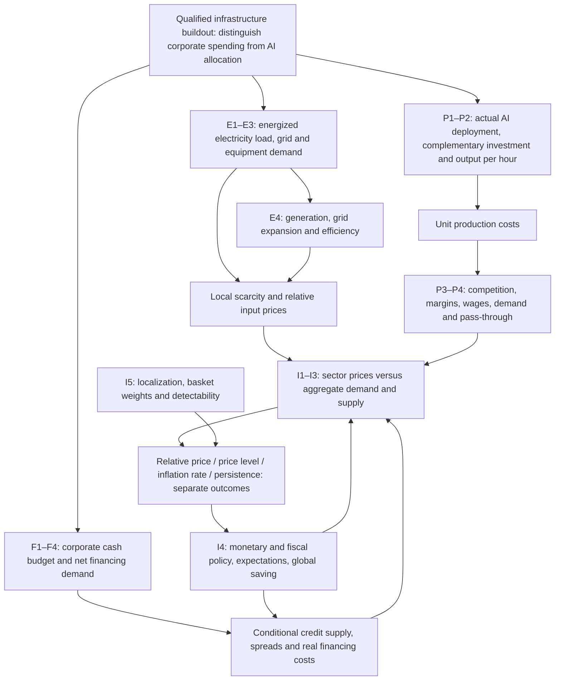

# AI infrastructure macroeconomic transmission map

All arrows below are **conditional research mechanisms**, not estimated effects. Traceable observations and qualification limits are in the evidence registry; E/F/P/I labels resolve to hypothesis-matrix.json.

| Horizon | Potential upward pressure | Potential downward pressure / offsets | Unresolved net result |
|---|---|---|---|
| 0–3 years | Load peaks, equipment/construction scarcity, short-run investment demand | Existing cash/supply slack, imports, crowding out, policy stabilization | Depends on geography, utilization, fuel, tariffs and policy |
| 3–7 years | Delayed grid expansion, sustained capital demand, rebound use | New generation/transmission, learning, adoption and lower unit costs | Adoption costs, margins and demand can absorb supply gains |
| 7–20 years | Repeated demand growth, constrained resources | Capital deepening, innovation, productive capacity | No observed long-run AI counterfactual or inflation coefficient |

The physical asset, its financing, corporate accounting and contractual support are different layers. A lease and project debt can support the same campus; they are not separate macro investment shocks. Customer advances already in OCF cannot be added again. Utility investment can expand supply and raise future regulated cost recovery simultaneously. Do not count it as corporate campus CapEx.

A project announcement is not a measured load shock. A task productivity gain is not national productivity. A fall in unit cost is not automatically a consumer price fall. A sector price increase is not persistent aggregate inflation. Market compensation is not a pure expectations survey. No arrow has a numerical forecast attached.
