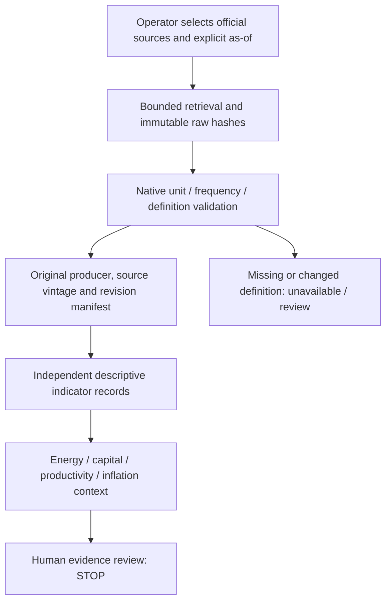

# Minimal future macro monitoring architecture — design only

## Purpose and boundaries

Independent descriptive indicators for four channels and the 0–3/3–7/7–20-year mechanism horizons. Horizons are interpretive, not forecast periods. Do not continue C1A-2, C1B event estimation or granular source acquisition. No production integration, scheduling, alerts/email, LLM, scenario laboratory or numerical AI inflation prediction.



## Small maintainable components

Four provider families suffice for the proposed core: EIA published workbook/table; Census construction workbook; official Federal Reserve FRED distribution with producer tags; Philadelphia Fed SPF workbook. BTOS is a gated manual context item until its numeric/weight adapter qualifies. BLS/BEA direct downloads can later be separately qualified alternates. Existing C1A weather is context, not an authorization for new microdata collection. No API secret is required for the verified public download paths; no browser API is contemplated.

1. A versioned selection manifest lists exactly twelve core IDs, units, transformations and native scope. No arbitrary URL crawling. Acquisition has timeout/size/redirect/host bounds, descriptive User-Agent, low rate, no repeated403/429 requests. New bytes create a new version; failure preserves last-valid records with stale status.
2. A content-addressed external cache plus small source manifest records URL, producer, response/hash, publication date, economic period and retrieval receipt. Large raw files remain outside Git. Avoid archiving unbounded snapshots.
3. Native records have `(indicatorId, geography, definitionVersion, period, sourceVintage, rawHash, locator, value, missingReason, sourceStatus)`. Nulls stay null. Provider estimates remain explicitly estimates; this is not inferred AI data.
4. An explicit `asOf` and source publication gate are mandatory. A source retrieved now cannot establish what was known years ago. Unknown publication date means no first-release backtest. Separate observation date, release date, retrieval time and qualification time. Current-vintage replay and real-time-vintage replay are distinct.
5. Descriptive outputs: levels, exact-period YoY where appropriate, status/missingness and old/new revision differences. Native quarter labels survive; SAAR is not actual annual spending. Yield changes use percentage points/basis points, not percentage growth on negative yields. Stock differences are not issuance. No averages of CPI/PCE, no summed energy/capital/productivity inflation effects.
6. Human channel notes list observed changes, conditional mechanisms, counterexplanations and grade justification separately. No mechanically generated net inflation direction, traffic-light risk score or ranked company advice.

## Leading/lagging questions without false identification

Construction may precede activity; realized commercial sales and fuel prices may co-move; investment and rates are jointly determined; adoption may precede measured output/hour; ULC can change before or alongside consumer prices. These are candidate orderings, not fitted lags. C2's first prototype should not perform lag mining. Any later analysis must preregister window/controls, stationary transformations, release timing, structural breaks, serial dependence, missingness and multiple-comparison handling. Predictive ordering is not causality; publish inconclusive outcomes.

Default retain separate native monthly, quarterly, daily and survey views. For an explicitly requested descriptive quarterly comparison, sum complete monthly physical flows, average comparable price/rate observations only with declared valid-day weighting, retain end-quarter stocks, and compare same economic periods while displaying release delay. Never interpolate quarterly data to monthly or sum SAAR levels. A change in frequency is an explicit versioned view, not a replacement of native observations. Different state prices require revenue/sales weights; 13-state counts are not a US panel or AI exposure classification.

## Missingness and maintenance

VERIFIED = authenticated applicable numeric input/definition. PARTIAL = metadata or subset qualified, remaining scope explicitly restricted. UNVERIFIED = proposed untested source/definition. UNAVAILABLE = no qualified value. Maintain separate source, history, latest and first-release flags. Aggregate AI consumption and AI-specific investment stay unavailable. BTOS old/new regimes and core/supplement remain separate. Exact release lags not authenticated are null; use calendar-based manual checks instead of guessed freshness alerts.

Keep module count small; stdlib extraction and offline contracts are adequate. One operator-run research snapshot can precede any public design. No new dependencies/database/infrastructure are needed in this phase. A passing test validates source integrity and definitions, never an E3/E4 macro conclusion.

## C1-M reproduction

```sh
PYTHONDONTWRITEBYTECODE=1 python3 research/ai-infrastructure-paper-validation/phase-c1m/test_phase_c1m.py
PYTHONDONTWRITEBYTECODE=1 python3 research/ai-infrastructure-paper-validation/phase-c1m/artifacts.py
PYTHONDONTWRITEBYTECODE=1 python3 research/ai-infrastructure-paper-validation/phase-c1m/artifacts.py --identity
```

`artifacts.py` is this phase's offline qualification/reproduction helper, not the future monitoring engine. It re-extracts thirteen small downloaded files plus frozen inherited EIA histories, emits deterministic coverage, validates metadata/references and checks530 baseline file hashes. No network/production writes occur. Own identity, execution-validation and retrieval receipts are excluded from research content identity; raw hashes and qualified fixed-cutoff metadata enter it. Different current downloads require new review; repeat execution using the same frozen inputs must be identical.
